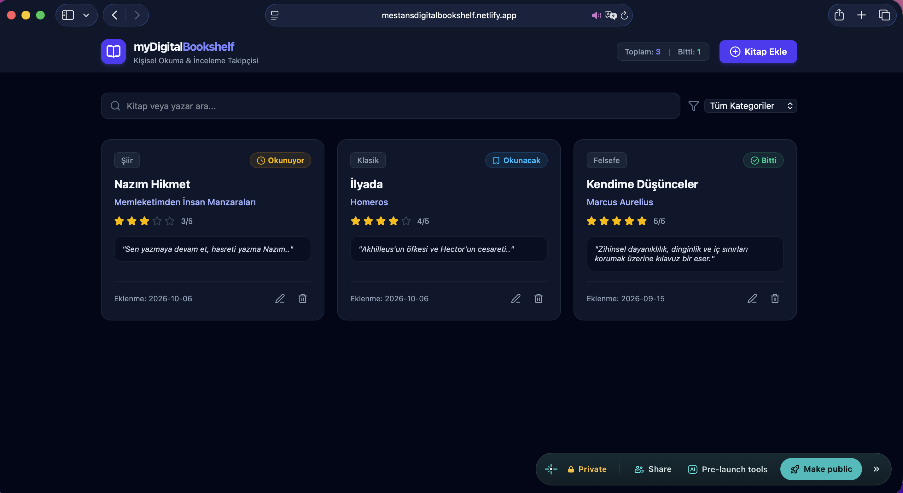

# 📚 myDigitalBookshelf

Modern JavaScript ve ReactJS ekosistemi kullanılarak geliştirilmiş, yerel depolama (LocalStorage) destekli kişisel kütüphane ve okuma takip uygulaması.

> **Canlı Demo:** [mestansdigitalbookshelf.netlify.app](https://mestansdigitalbookshelf.netlify.app)

---

## 📸 Proje Ekran Görüntüsü



---

## 🚀 Proje Hakkında & Özellikler

Bu proje, modern web geliştirme pratikleri doğrultusunda bileşen tabanlı (Component-based) mimariyle sıfırdan inşa edilmiştir:

- **CRUD Operasyonları:**
  - **Create (Ekleme):** Kitap adı, yazar, kategori, okuma durumu, puan ve kişisel inceleme notu ekleme.
  - **Read (Listeleme):** Eklenen eserleri Tailwind CSS ızgara yapısında dinamik kartlar olarak listeleme.
  - **Update (Güncelleme):** Mevcut kitapların bilgilerini ve inceleme notlarını modal aracılığıyla düzenleme.
  - **Delete (Silme):** İstenmeyen kayıtları kütüphaneden güvenli şekilde kaldırma.
- **Dinamik Arama & Filtreleme:** Kitap ve yazar adına göre gerçek zamanlı arama; türe göre kategorik filtreleme.
- **Kalıcı Depolama (LocalStorage):** Sayfa yenilendiğinde verilerin kaybolmaması için tarayıcı hafızasıyla senkronize çalışma.
- **Duyarlı Tasarım (Responsive):** Mobil, tablet ve masaüstü ekranlara uyumlu koyu (dark mode) arayüz.

---

## 🛠️ Kullanılan Teknolojiler

- **Çatı:** ReactJS (Vite)
- **Stil & Arayüz:** Tailwind CSS
- **İkon Seti:** Lucide React
- **Durum Yönetimi:** React Hooks (`useState`, `useEffect`)
- **Yayınlama (Deployment):** Netlify & GitHub

---

## 💻 Kurulum & Yerel Çalıştırma

Projeyi yerel makinenizde çalıştırmak için:

```bash
# Depoyu klonlayın
git clone https://github.com/mestan4/myDigitalBookshelf.git

# Proje dizinine girin
cd myDigitalBookshelf

# Bağımlılıkları yükleyin
npm install

# Geliştirici sunucusunu başlatın
npm run dev